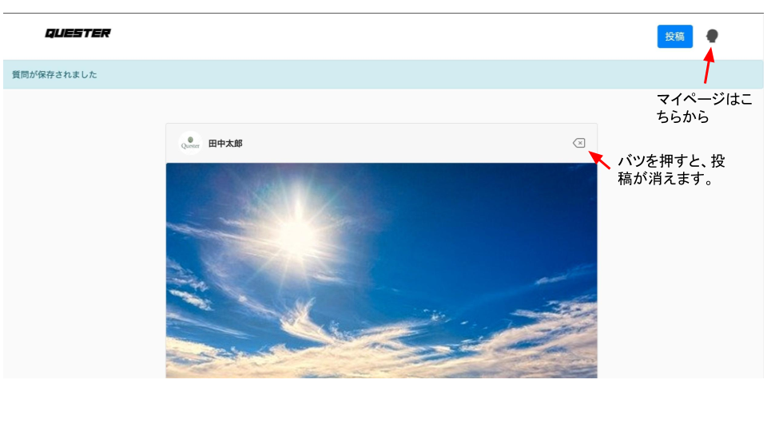
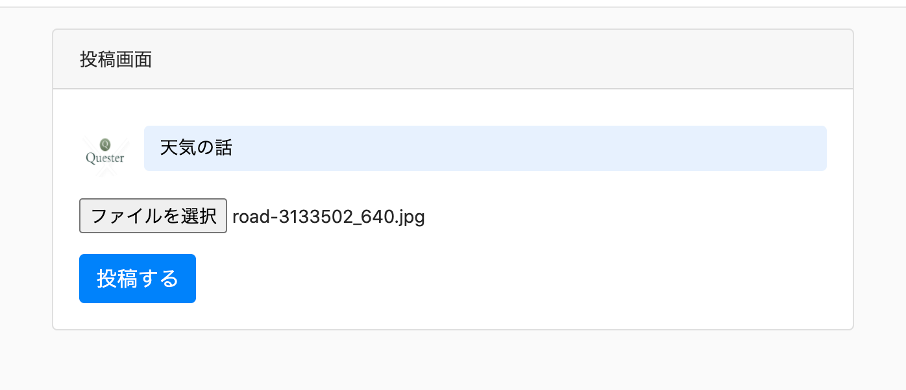
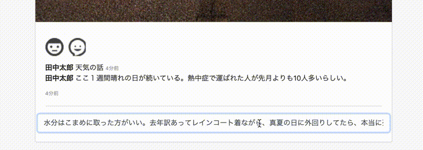

# README  
# Quester  
QuesterはSNSサイトを元にした雑談練習用サイトです。  

最初の投稿者がシンプルなお題を画像を交えて出題します。  
その後、コメント欄で投稿者やその他のユーザーがその日あったことや知識、ツッコミを交えて、会話を発展させていきます。  

現在は、単純なコメント欄といいね機能を実装していますが、今後intro.jsを使用したチュートリアル機能や投稿画面の添付画像のサムネイル化、顔文字の対応等を検討してます。  

# DEMO
トップ画面  
  
投稿  
  
コメント投稿&いいね  
  

# Requirement  

* ruby '2.5.1'  
 'rails', '~> 5.2.3'  
 'mysql2', '>= 0.4.4', '< 0.6.0'  

# Author

* 作成者:川浪裕太郎  
* E-mail:o76.kawanami.yutaro@gmail.com  

# License  
©Quester 2020  